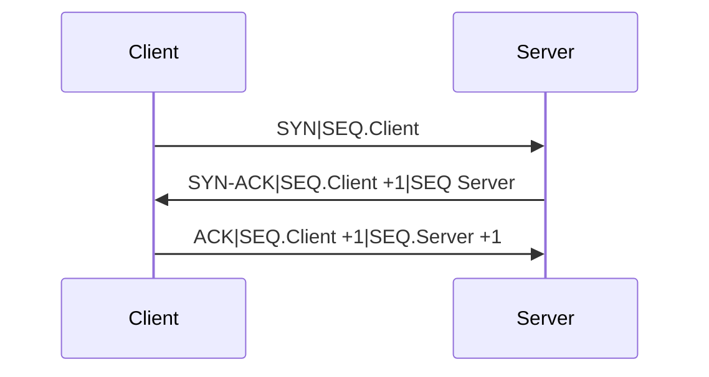

# TCP

---
Is a [[Protocol]]  / standard for exchanging data between different devices in a computer network.

`SYN`- synchronize ( Random number   |    Client SYN 842 - Sever SYN 383 )  
`SEQ`- sequence 
`ACK`- acknowledgment  
