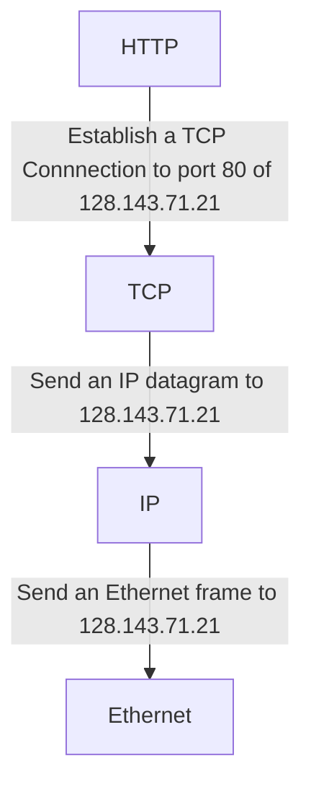

# TCP/IP

---
It a model  similar to  [[ISO]] or we can say is a set of [[Protocol]]s 

```mermaid
flowchart TB  
    HTTP --Establish a TCP Connnection to port 80 of 128.143.71.21--> TCP
    TCP --Send an IP datagram to 128.143.71.21--> IP
    IP --Send an Ethernet frame to 128.143.71.21--> Ethernet   
```
